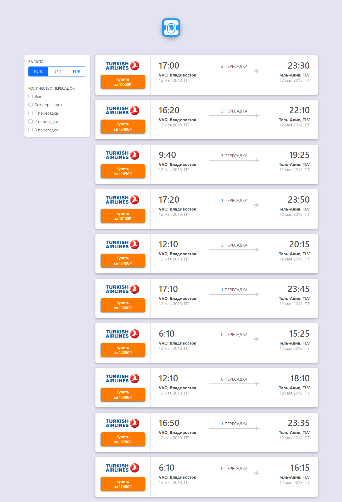

(P - project) REACT. Ticketing page with filters.   
Created:
1. Data tickets taken from file, rendered on page, filtered by price.
2. Filtering tickets in the output by the number of connections. 
Used - React JS

